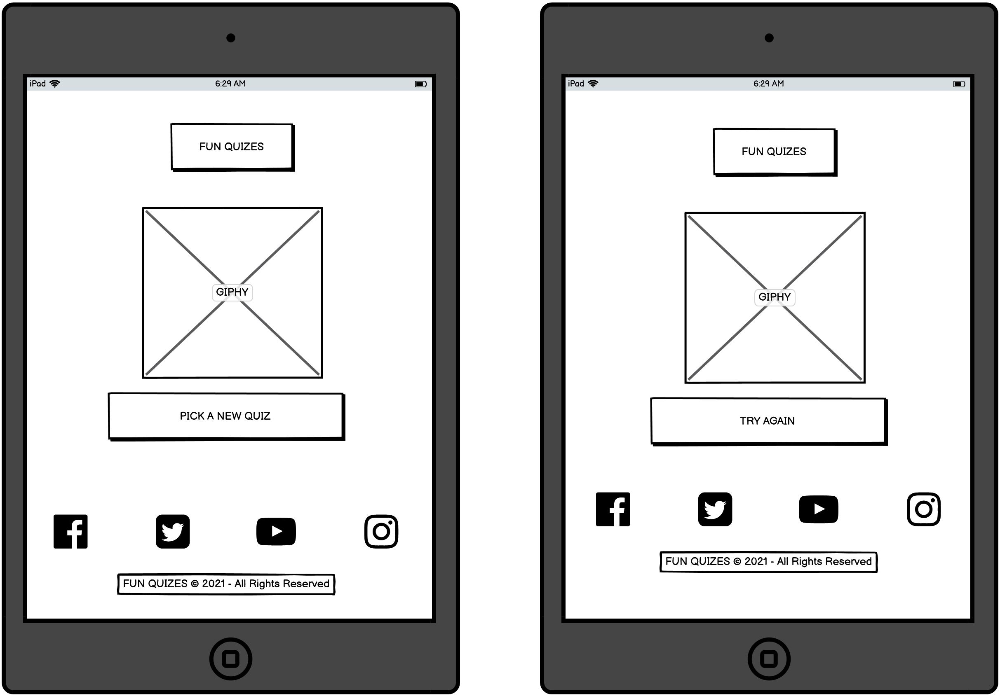

# FUN QUIZES

## Description: Code Institute Student Project 2: 

A website targeted to users who want to test there trivia knowledge with multiple levels of difficulty to choose from. 
It showcases my HTML, CSS and Javascript ability.

A live website can be found [here](https://kevinfaaa.github.io/kevs-project-portfolio-2/).

# Table of Contents
- [1. Introduction](#introduction)
- [2. Testing](#testing)
- [3. Bugs](#bugs)
- [4. Future Updates](#future-updates)
- [5. Contribution Links](#contribution-links)
- [6. Deployment](#deployment)
- [7. Wireframe](#wireframe)
- [8. Walk Through](#Walk-Through)

# 1. Introduction
[Go to the top](#table-of-contents)

This is the secound website I created and is part of my project portfolio required in the Full-Stack Software Development Diploma I am currently undertaking.
the aim of this website is to showcase my Javascript ability and demonstrate what I have learnt so far. 
The aim of the website is to provide a Fun Quiz for it's useres:
-	The website should be simple to navigate.
-	The website should provide three quiz topics with three levels of difficulty to choose from, therefore there are nine quiz possibilites to choose from.
-	The website should have a timer of one minute to reach a score of 10 for each quiz. 
-	The user should understand how the website works from the landing page.
-   The user should be able to choose the level of difficulty he/she chooses from the landing page.
-   The user should have a choice of three quiz topics to choose from (Geography/History/Sport).
-   The user should be able to play with nine different quizes.
-   The user should be re-directed to the wining page if he/she gets a score of ten in any quiz.
-   The user should be re-directed to the times up page if he/she runs out of time when playing any quiz.

## How to use
The website can be operated by the following:
### Landing Page
#### Header and Navigation Bar
The header (FUN QUIZES) is on all webpages and when clicked you're re-directed to the landing page.
 
The navigation bar (EASY/MEDUIM/HARD) is only available on the landing page and navigates you to easy/medium/hard quiz topic page.

#### Instructions Section
The instructions section explains to the user how the quiz works.

#### Form Section 
The form section allows the user to to submit there details and submit a comment to inform the creator of the user experience.
This inofrmation is submited is posted to https://formdump.codeinstitute.net.
 
#### Footer
The footer contains links to the following social media websites:
1. Facebook
2. Twitter
3. YouTube
4. Instagram

Below the social media links is a copyright notice.

### Quiz Topic Page
##### The following outlines the How To Use for Easy/Medium/Hard webpages topics as they all have the same functionality.
##### The only difference is that they re-direct the user to different quizes, everything else remains the same.
#### Header
The header (FUN QUIZES) re-directs the user to the landing page.

#### Choose a Quiz Section
The choose a quiz section gives the user a choice of three quizes to choose from.
Once the user clicks on a quiz topic, the quiz opens on a new webpage for th user to play.
The quis topics are:
1. Geography
2. History
3. Sport

#### Footer
The footer contains links to the following social media websites:
1. Facebook
2. Twitter
3. YouTube
4. Instagram

Below the social media links is a copyright notice.

### Quiz Page
##### The following outlines the How To Use for all nine possible quizes to choose from as they all have the same functionality.
##### The only difference is that the user will be asked differnet questions with different degrees of difficulty, everything else remains the same.
#### Header
The header (FUN QUIZES) re-directs the user to the landing page.

#### Timer
The timer counts down from one minute gives the user one minute to reach a score of ten to complete the quiz.
 
Should the user reach a score of ten under one minute he/she will be re-directed to the winners page.
  
Should the user fail to reach a score of ten under one minute he/she will be re-directed to the times up page.

##### Quiz
The quiz section is rondomly populated with a question and three possible answers to choose from.
 
The answers have one correct answer to the question and two incorrect answers.
 
Should the user choose the correct answer to the question the score will increase by one.
 
Should the user choose the wrong answer to the question the score will remain the same.

#### Footer
The footer contains links to the following social media websites:
1. Facebook
2. Twitter
3. YouTube
4. Instagram

Below the social media links is a copyright notice.

### Winners Page
#### Header
The header (FUN QUIZES) re-directs the user to the landing page.

#### Winners Section
A Giphy informing the user they won.

#### Pick a new Quiz
The "PICK A NEW QUIZ" button re-directs the user to the landing page.

#### Footer
The footer contains links to the following social media websites:
1. Facebook
2. Twitter
3. YouTube
4. Instagram

Below the social media links is a copyright notice.

### Times Up Page
#### Header
The header (FUN QUIZES) re-directs the user to the landing page.

#### Times Up Section
A Giphy informing the user that there time is up.

#### Try Again
The "TRY AGAIN" button re-directs the user to the landing page.

#### Footer
The footer contains links to the following social media websites:
1. Facebook
2. Twitter
3. YouTube
4. Instagram

Below the social media links is a copyright notice.

# 2.	Testing

[Go to the top](#table-of-contents)

## Google Develop Tools
Google Developer Tools is used test bug fixes on the fly.
 
Google Developer Tools was really important when making the website responsive and testing console.logs when developing my javascript. 

##	The W3C Markup validation Service

I used [W3C Markup Validator](https://validator.w3.org/#validate_by_input+with_options) to check for any errors within my HTML pages.

### Landing Page

#### Errors Found:

Document checking completed. No errors to show.

#### Warnings Found:

Document checking completed. No warnings to show.

### Quiz Topic Page 

#### Errors Found:

Document checking completed. No errors to show.

#### Warnings Found:

1. Warning: Section lacks heading. Consider using h2-h6 elements to add identifying headings to all sections.
- From line 19, column 5; to line 19, column 30.
- Warning not fixed.

### Quiz Page

#### Errors Found:

Document checking completed. No errors to show.

#### Warnings Found:

1. Warning: Section lacks heading. Consider using h2-h6 elements to add identifying headings to all sections.
- From line 19, column 5; to line 19, column 31.
- Warning not fixed.

##	The W3C CSS validation Service

I used [W3C CSS Validator](https://jigsaw.w3.org/css-validator/#validate_by_input) to check for any errors within my CSS page.

### Errors Found:
Congratulations! No Error Found.

### Warnings Found:
Congratulations! No Warning Found.

##	Am I responsive?

I used [Am I Responsive](http://ami.responsivedesign.is/) to view how my website is displayed on different media viewports. The results suggust that the webisite is responsive for the follwoing devices:
- Widescreen desktop.
- Laptop.
- Ipad.
- Mobile Phone (iPhone X).

##	Manual Testing

### Landing Page
#### Header and Navigation Bar
##### FUN QUIZES
- When “FUN QUIZES” is left clicked with the mouse, the browser sends the user to the Landing page. It worked as expected.
##### EASY
- When “EASY” is left clicked with the mouse, the browser sends the user to the "Easy Topics" webpage. It worked as expected.
##### MEDIUM
- When “MEDIUM” is left clicked with the mouse, the browser sends the user to the "Medium Topics" webpage. It worked as expected.
##### HARD
- When “HARD” is left clicked with the mouse, the browser sends the user to the "Hard Topics" webpage. It worked as expected.

### Form Section
##### First name
- can add text to the input tag, It works as expected.
##### Last name 
- can add text to the input tag, It works as expected.
##### Email address 
- can add text to the input tag, It works as expected.
##### Leave a Comment 
- can add text to the input tag, It works as expected.

The inofrmation that is submited is posted to https://formdump.codeinstitute.net. It Submits as expected. 

#### Footer
##### social media links
###### Facebook
- When the Facebook icon is clicked with the mouse, a new tab opens and redirects the user to the homepage of the Facebook website. It works as expected.
###### Twitter
- When the Twitter icon is clicked with the mouse, a new tab opens and redirects the user to the homepage of the Twitter website. It works as expected.
###### YouTube
- When the YouTube icon is clicked with the mouse, a new tab opens and redirects the user to the homepage of the YouTube website. It works as expected.
###### Instagram
- When the Instagram icon is clicked with the mouse, a new tab opens and redirects the user to the homepage of the Instagram website. It works as expected.

### QUIZ Topic Page
#### Header
##### FUN QUIZES
- When “FUN QUIZES” is left clicked with the mouse, the browser sends the user to the Landing page. It worked as expected.

##### Quiz Topic Section
##### Geography
- When the “GEOGRAPHY” anchor is left clicked with the mouse, the browser sends the user to the Geography Quiz page. It worked as expected.
##### History
- When the “HISTORY” anchor is left clicked with the mouse, the browser sends the user to the History Quiz page. It worked as expected.
##### Sport
- When the “SPORT” anchor is left clicked with the mouse, the browser sends the user to the Sport Quiz page. It worked as expected.

#### Footer
##### social media links
###### Facebook
- When the Facebook icon is clicked with the mouse, a new tab opens and redirects the user to the homepage of the Facebook website. It works as expected.
###### Twitter
- When the Twitter icon is clicked with the mouse, a new tab opens and redirects the user to the homepage of the Twitter website. It works as expected.
###### YouTube
- When the YouTube icon is clicked with the mouse, a new tab opens and redirects the user to the homepage of the YouTube website. It works as expected.
###### Instagram
- When the Instagram icon is clicked with the mouse, a new tab opens and redirects the user to the homepage of the Instagram website. It works as expected.

### QUIZ Page
#### Header
##### FUN QUIZES
- When “FUN QUIZES” is left clicked with the mouse, the browser sends the user to the Landing page. It worked as expected.

#### Timer
- The timer counts down from one minute. It worked as expected.
- when the timer count down to zero, the user is re-directed to the times up webpage. It worked as expected.

#### Quiz Section
- A random question from a possible ten is genterated. It worked as expected.
- When an answer button is left clicked for a correct answer the score increase by one. It worked as expected.
- When an answer button is left clicked for a wrong answer the score cannot change. It worked as expected.
- when the score populates with the number ten, the user is re-directed to the winners webpage. It worked as expected.

#### Footer
##### social media links
###### Facebook
- When the Facebook icon is clicked with the mouse, a new tab opens and redirects the user to the homepage of the Facebook website. It works as expected.
###### Twitter
- When the Twitter icon is clicked with the mouse, a new tab opens and redirects the user to the homepage of the Twitter website. It works as expected.
###### YouTube
- When the YouTube icon is clicked with the mouse, a new tab opens and redirects the user to the homepage of the YouTube website. It works as expected.
###### Instagram
- When the Instagram icon is clicked with the mouse, a new tab opens and redirects the user to the homepage of the Instagram website. It works as expected.

#### Winners Page
#### Header
##### FUN QUIZES
- When “FUN QUIZES” is left clicked with the mouse, the browser sends the user to the Landing page. It worked as expected.
##### PICK A NEW QUIZ
- When "PICK A NEW QUIZ" is left clicked with the mouse, the browser sends the user to the Landing page. It worked as expected.

#### Times Up Page
#### Header
##### FUN QUIZES
- When “FUN QUIZES” is left clicked with the mouse, the browser sends the user to the Landing page. It worked as expected.
##### TRY AGAIN
- When "TRY AGAIN" is left clicked with the mouse, the browser sends the user to the Landing page. It worked as expected.

# 3.	Bugs

[Go to the top](#table-of-contents)

1. The shuffle function used to generate random questions on the quiz webpage is based on the [Durstenfeld shuffle](https://en.wikipedia.org/wiki/Fisher%E2%80%93Yates_shuffle#The_modern_algorithm) algorithm. The function shuffles the questions and generates 
a random question as expected, but there is a bug as while the shuffle function works as expected, the same question can be generated more then once meaning the user may be asked the same question twice and recieve a score for giving the correct answer to a question he/she already answered. 
 
Perhaps the Durstenfeld shuffle algorithm is not the best function to use or needs to be developed further for what I'm trying to acheive.

2. When publishing my GitPod workspace to GitHub Pages, a number of issues appeared due to the file path structure used.
 
Initially I created a html folder and placed it in my assets folder to hold all my html files accept for the index.html file.
 
This worked fine when using GitPod, but once I published to GitHub the styling and href links stopped working.
 
To Resolve this problem I took all html files out of the assets/html folder and placed them along side the index.html file. It resolved the issue.
 
A similar issue was experienced when linking my javascript functions to my index.html.
 
Again when using GitPod I was able to link my javascript functions to me index.html, but once I published to GitHub the links re-directed me to a 404 page.
 
Unfortunatly the only solution I could find was to either have the javascript functions link to index.html on my GitPod workspace or my GitHub.
 
I decided to use the path link to GitHub so the project could be fully deployed.

3. When developing my Landing page I wanted to create a yellow footer with my social icons in red, but when I creted it I was unable to push it to the bottom of the page, the red background colour was still visable.
 
To mitigate the problem I updated the styling and changed the footer colour to the same as the background colour and gave the social icons the yellow color.
 
I think the solution looks better to my inital vision.

4. The styling of the quiz page on mobile can be improved. 
 
The questions when viewed on mobile have limited space for long questions, while there is a considerable space between the "Question" and "Question being asked".

# 4.	Future Updates

[Go to the top](#table-of-contents)

1. Look into an alternative for the Durstenfeld shuffle algorithm or develop this algorithm further as it shuffles the questions on the quiz webpage as expected but to improve the user experience a question should only be randomly generated once, meaning the same question should not be generated on more then one occasion. 
2. When the user selects a wrong answer the button will turn red instead of turning blue.
3. Look at reviewing the question area when viewing on mobile, put the "Question" above the "Question being asked" allowing more room for long questions and making them easlier more readable.
4. Make the styling mor fun, add emoji's to some of the headings.
5. Add a stop/start function to the timer on the quiz pages.
6. Add a Google Charts to the landing page for users to track there quiz difficulty progression. 

# 4.	Contribution Links

[Go to the top](#table-of-contents)

- [Font Awesome Icons](https://fontawesome.com/v4.7/icons/)
- [MDN Web Docs](https://developer.mozilla.org/en-US/docs/Web/HTML/Element/input)
- [W3schools](https://www.w3schools.com/cssref/pr_text_text-align.asp)
- [Google fonts](https://fonts.google.com/)
- [Stack exchange](https://stackexchange.com/)
- [Stack overflow](https://stackoverflow.com/)
- [Am I responsive?](http://ami.responsivedesign.is/)
- [W3C Markup validation](https://validator.w3.org/#validate_by_input)
- [W3C CSS validation](https://jigsaw.w3.org/css-validator/)
- [Durstenfeld shuffle](https://en.wikipedia.org/wiki/Fisher%E2%80%93Yates_shuffle#The_modern_algorithm) 
- [Quiz Function (CodePen)](https://codepen.io/savant/pen/gbaveO)
- [Timer Function (CSS Tricks)](https://css-tricks.com/how-to-create-an-animated-countdown-timer-with-html-css-and-javascript/)
- [Quiz Questions](https://www.express.co.uk/life-style/life/1278265/100-general-knowledge-quiz-questions-and-answers)
- [GIPHY](https://giphy.com/search/times-up)

# 5.	Deployment

[Go to the top](#table-of-contents)

This webidte was deployed via GitHub Pages. The following steps explain the deployment process:

- Open your GitHub repository.
- Go to settings within your repository.
- Scroll down to GitHub Pages. This has its own dedicated tab, Click to open it.
- When in the GitHub Pages tab go to the Source section and click on the source dropdown and select master. 
- Once master is selected click the save button which is also located in the Source section.
- Once saved, the page will refresh and your site will now be published, it may take a few minutes to publish (it is good to be aware of this).
- A link to your published webiste can now be found at the top of the GitHub page.

# 7. Wireframe

[Go to the top](#table-of-contents)

## Desktop Landing Page

 

## Desktop Quiz Topic Page

## Desktop Quiz Page

## Desktop Winners Page

## Desktop Times Up Page

## iPad Landing Page

## iPad Quiz Topic and Quiz Page

## iPad Winners and Times Up Page

## iPhone X Landing Page and Quiz Topics Page

## iPhone X Quiz, Winners and Times Up Page

# 7. Walk Through

[Go to the top](#table-of-contents)

## Landing Page

 

## Quiz Topic Page

## Quiz Page

## Winners Page

## Times Up Page

